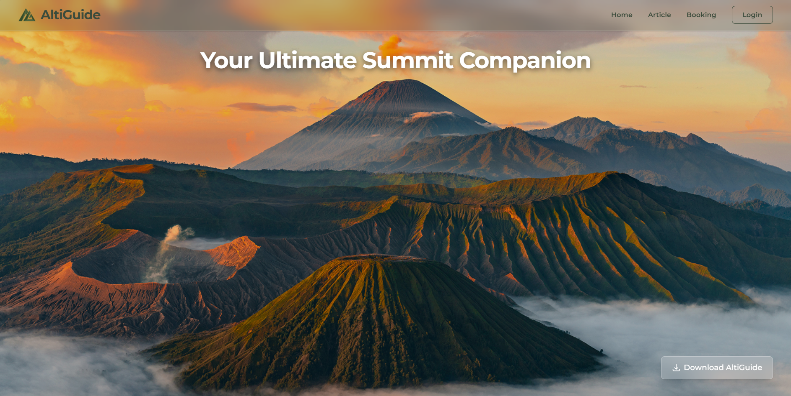
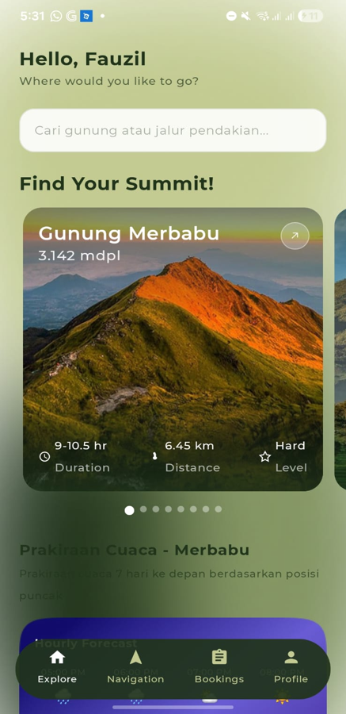

# AltiGuide 🗺️⛰️

<!-- GitHub Badges -->


Dokumen ini merupakan kesepakatan resmi anggota tim untuk memastikan kelancaran kolaborasi serta dokumentasi sistem selama praktikum Rekayasa Perangkat Lunak (RPL).

## 📄 Deskripsi Proyek
**AltiGuide** adalah platform navigasi dan registrasi pendakian gunung terintegrasi. Platform ini dirancang untuk mempermudah manajemen keselamatan pendaki melalui fitur registrasi daring (SIMAKSI), pemetaan rute luring, serta penyediaan informasi administratif pendakian yang komprehensif. Proyek ini dibangun menggunakan arsitektur *multi-platform* yang andal:
- **Web App & API Gateway**: Dibangun menggunakan **Laravel 13**, **Inertia.js**, dan **Vue.js**.
- **Mobile Native Client**: Dibangun menggunakan **Android Native (Kotlin)** dengan **Jetpack Compose** untuk antarmuka yang responsif.

---

## ✨ Daftar Fitur Utama
* **Authentication System**: Sistem Login dan Register menggunakan arsitektur Laravel + Inertia.js untuk menjamin keamanan akses akun pendaki.
* **Mountain & Article Exploration**: Halaman eksplorasi informasi detail gunung (deskripsi, foto, integrasi rute) serta rekomendasi destinasi berbasis data dinamis dari database.
* **Online Booking SIMAKSI System**: Sistem registrasi pendakian daring yang memandu pengguna melalui alur pemilihan destinasi, inisiasi grup/manifes, hingga kalkulasi rincian biaya tiket secara *real-time*.
* **Offline Navigation Tracking**: Modul navigasi luring pada aplikasi mobile memanfaatkan data koordinat `.gpx` untuk keselamatan pendaki di area minim sinyal.

---

## 📸 Antarmuka Aplikasi (Screenshots)

| Web Dashboard Admin | Mobile Client Interface |
| :---: | :---: |
|  |  |
| *Tampilan Landing Page Utama Website AltiGuide* | *Tampilan Halaman Utama / Eksplorasi Gunung pada Aplikasi Android* |

---

## 🚀 Panduan Instalasi & Menjalankan Aplikasi (Setup Guide)

Ikuti instruksi di bawah ini dengan saksama untuk memasang dan menjalankan AltiGuide di lingkungan lokal Anda.

### 1. Prasyarat Sistem (Prerequisites)
Sebelum memulai, pastikan perangkat lokal Anda sudah terpasang:
* **PHP >= 8.3**
* **Composer** (Dependency manager untuk PHP)
* **Node.js (v18 ke atas) & npm**
* **PostgreSQL** atau **SQLite**
* **Android Studio** (Untuk menjalankan komponen mobile)

---

### 2. Setup Backend & Web App (`src/altiguide-web`)

1. **Masuk ke direktori kerja:**
   ```bash
   cd src/altiguide-web
   ```

2. **Salin konfigurasi environment:**
   ```bash
   cp .env.example .env
   ```
   *(Untuk pengguna Windows Command Prompt (CMD), gunakan `copy .env.example .env`)*

3. **Konfigurasi Database pada file `.env`:**
   * **Opsi A: Menggunakan PostgreSQL (Sesuai Konfigurasi Default)**
     Buat database bernama `altiguide_db` di PostgreSQL Anda, lalu sesuaikan kredensial berikut di file `.env`:
     ```env
     DB_CONNECTION=pgsql
     DB_HOST=127.0.0.1
     DB_PORT=5432
     DB_DATABASE=altiguide_db
     DB_USERNAME=username_postgres_anda
     DB_PASSWORD=password_postgres_anda
     ```
   * **Opsi B: Menggunakan SQLite (Lebih Praktis untuk Uji Coba)**
     Sesuaikan konfigurasi database di file `.env` menjadi:
     ```env
     DB_CONNECTION=sqlite
     ```
     Hapus atau beri komentar (`#`) pada baris `DB_HOST`, `DB_PORT`, `DB_DATABASE`, `DB_USERNAME`, dan `DB_PASSWORD`.
     Kemudian, buat file database SQLite kosong di dalam direktori `database/`:
     * Di Linux/macOS/Git Bash: `touch database/database.sqlite`
     * Di Windows (PowerShell): `New-Item database/database.sqlite`
     * Di Windows (CMD): `type nul > database/database.sqlite`

4. **Instal Dependensi & Setup Otomatis:**
   Gunakan script setup bawaan Composer yang akan menginstal dependensi PHP & Node.js, men-generate key, dan melakukan build asset frontend secara otomatis:
   ```bash
   composer run setup
   ```
   *Catatan: Jika migrasi gagal di langkah ini karena koneksi database belum siap, silakan selesaikan konfigurasi database di file `.env` terlebih dahulu, kemudian jalankan langkah 5 secara manual.*

5. **Jalankan Migrasi & Seeder Database:**
   Isi database dengan data awal yang diperlukan (daftar gunung, rute pendakian, artikel, dsb.) dengan menjalankan:
   ```bash
   php artisan migrate --seed
   ```

6. **Menjalankan Server Aplikasi:**
   Anda dapat menjalankan server backend (Laravel) dan frontend compiler (Vite) secara bersamaan menggunakan perintah:
   ```bash
   composer run dev
   ```
   *Secara otomatis perintah ini akan menjalankan:*
   * Laravel Development Server di `http://localhost:8010`
   * Vite Dev Server untuk kompilasi Vue/JS secara real-time
   * Laravel Queue Worker untuk memproses antrean tugas di latar belakang
   * Laravel Pail untuk melihat log secara interaktif

   *Atau, Anda dapat menjalankannya secara terpisah di tab terminal baru:*
   * **Backend server:** `php artisan serve --port=8010`
   * **Frontend Vite:** `npm run dev`

---

### 3. Setup Mobile App (`src/altiguide-mobile`)

Ikuti langkah-langkah berikut untuk membuka dan menjalankan proyek aplikasi Android:

1. **Buka Project di Android Studio:**
   * Buka Android Studio.
   * Pilih menu **File > Open** atau **Open an Existing Project**.
   * Arahkan ke folder `src/altiguide-mobile` di dalam repositori ini, lalu klik **OK**.

2. **Sinkronisasi Gradle:**
   * Tunggu hingga Android Studio selesai mengunduh dependensi dan melakukan sinkronisasi Gradle (proses *Gradle Sync*). Pastikan koneksi internet Anda stabil.

3. **Konfigurasi Alamat API/Backend:**
   * Secara default, aplikasi Android dikonfigurasi untuk terhubung ke localhost backend melalui emulator Android di alamat `http://10.0.2.2:8010/` (sesuai dengan port server Laravel di langkah sebelumnya).
   * Pastikan server backend Laravel Anda (`src/altiguide-web`) sedang berjalan sebelum membuka aplikasi di emulator.
   * Jika Anda menggunakan **perangkat fisik (physical device)** untuk testing, pastikan handphone dan laptop berada dalam jaringan Wi-Fi yang sama, lalu ubah alamat base URL pada konfigurasi Retrofit/Dagger Hilt (di `AppModule.kt`) menggunakan alamat IP lokal laptop Anda (misal: `http://192.168.1.XX:8010/`).

4. **Jalankan Aplikasi:**
   * Hubungkan perangkat Android fisik (aktifkan *USB Debugging*) atau jalankan Android Virtual Device (Emulator).
   * Klik tombol **Run (ikon play hijau)** di bagian atas Android Studio untuk melakukan compile dan meng-install aplikasi ke perangkat target.

---

# 👥 Piagam & Aturan Tim (Team Contract)
## 1. Peran Anggota Tim (Team Roles)
Setiap anggota bertanggung jawab atas tugas utama berikut:

* **Fauzil Azhim**: **Lead Developer & Backend**
  * Bertanggung jawab atas desain arsitektur sistem dan struktur basis data (SQL).
  * Mengelola logika bisnis di sisi server dan integrasi API.
  * Melakukan peninjauan kode (*code review*) pada setiap Pull Request untuk menjaga kualitas kode di repositori.

* **Adrian Alviano Susatyo**: **Quality Assurance (QA) & Frontend**
  * Bertanggung jawab melakukan pengujian fungsionalitas (Black-box testing) pada setiap fitur yang selesai dibuat.
  * Mendokumentasikan bug atau error ke dalam Issue Tracker dan memantau proses perbaikannya.
  * Mengembangkan komponen antarmuka pengguna (Frontend) berdasarkan desain yang telah disepakati.

* **Daniel Ferdian Napitupulu**: **Quality Assurance (QA), Documentation & Technical Writer**
  * Bertanggung jawab menyusun laporan resmi praktikum Bab I hingga Bab akhir.
  * Mengelola dokumentasi teknis dalam repositori seperti file README, Wiki, dan dokumentasi endpoint API.
  * Memastikan seluruh artefak proyek (diagram UML, ERD) terdokumentasi dengan rapi sesuai standar RPL.

* **Diva Valencia Christianarta**: **UI/UX Designer**
  * Bertanggung jawab atas riset pengalaman pengguna dan pembuatan desain *high-fidelity* (Mockup) serta Prototype.
  * Mengimplementasikan desain antarmuka menjadi kode frontend yang responsif dan user-friendly.
  * Memastikan konsistensi visual (warna, tipografi, dan aset gambar) di seluruh bagian aplikasi.

## 2. Jadwal Pertemuan (Meeting Schedule)
Pertemuan rutin dilakukan untuk sinkronisasi progress:
* **Hari**: Setiap hari Jumat
* **Waktu**:  19.00 WIB - Selesai
* **Platform**:  Google Meet / Discord / Zoom/ Offline
* **Agenda**: Update progress mingguan, pembagian task baru, dan penyelesaian kendala teknis.

## 3. Saluran Komunikasi (Communication Channels)
* **Komunikasi Harian**: Whatsapp Group untuk koordinasi cepat dan pengumuman penting.
* **Diskusi Teknis**: Discord, Zoom, atau Google Meet untuk diskusi mendalam terkait pengembangan dan permasalahan teknis.
* **Manajemen Tugas**: Spreadsheet Google Sheets untuk pembagian tugas, tracking progress, dan deadline, Opsional Menggunakan Scrum /Trello untuk manajemen proyek yang lebih terstruktur.

## 4. Aturan Respons (Communication Policy)
Untuk menjaga efisiensi kerja, seluruh anggota tim menyepakati:
* **Jam Aktif**: 09:00 - 17:00 WIB
* **Waktu Respons**: Maksimal **2 jam** setelah pesan dikirimkan pada jam aktif.
* **Ketersediaan**: Jika anggota akan tidak aktif (berhalangan) lebih dari 12 jam, wajib menginfokan tim terlebih dahulu.

## 5. Standar Pesan Commit (Commit Message Standards)
Gunakan format **imperative** dalam Bahasa Inggris atau Bahasa Indonesia untuk setiap perubahan di repositori:
* **Format**: `[Tag]: [Short Description]`
* **Contoh Tag**: `feat` (fitur baru), `fix` (perbaikan bug), `docs` (dokumentasi), `style` (formatting).
* **Contoh Pesan**:
    * `feat: add login validation logic`
    * `fix: resolve null pointer exception in database connection`
    * `docs: update team contract file`

## 6. Mekanisme Eskalasi (Escalation Mechanism)
Jika terjadi masalah yang tidak dapat diselesaikan secara internal:
1.  **Diskusi Internal**: Masalah dibahas terlebih dahulu dalam pertemuan tim secara terbuka.
2.  **Deadlock/Konflik**: Jika terjadi jalan buntu dalam pengambilan keputusan atau masalah komitmen anggota, ketua tim akan mengambil keputusan akhir.
3.  **Bantuan Eksternal**: Jika masalah tetap tidak teratasi atau mengganggu keberlangsungan proyek, tim akan segera menghubungi **Asisten Praktikum** sebagai mediator/pemberi solusi.

---
*Kontrak ini disepakati oleh seluruh anggota tim pada tanggal [2 April 2026].*